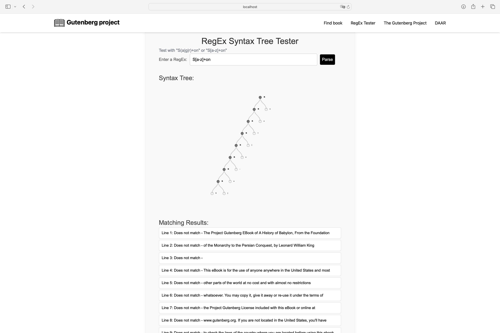
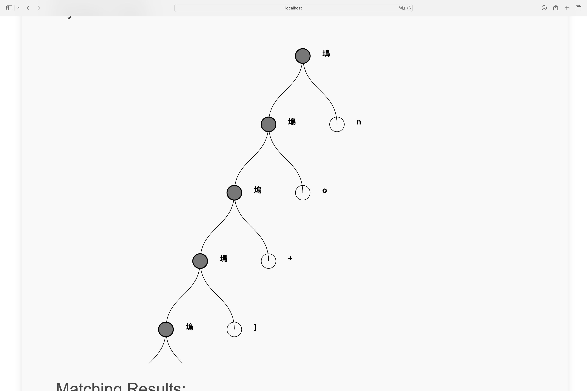

# **RegEx Syntax Tree Tester**

  
_Figure: Interface of the RegEx Syntax Tree Tester application_

## **Description**

The **RegEx Syntax Tree Tester** is a web application that allows users to test regular expressions and transform them into a **Deterministic Finite Automaton (DFA)**. The project is based on concepts such as regular expression parsing, the construction of non-deterministic finite automata (NFA), their conversion into DFA, and DFA minimization. It is developed using **React.js** with **TypeScript** and uses **D3.js** to visualize syntax trees.

The application allows the user to:

- Enter a regular expression.
- Visualize the syntax tree generated from the expression.
- View the matching results of the text lines in the file against the provided expression.

## **Features**

- **Regular Expression Parsing**: Transforms the expression into a **syntax tree**.
- **NFA Construction**: Converts the syntax tree into a **Non-Deterministic Finite Automaton**.
- **DFA Conversion**: Transforms the NFA into a **DFA** via the subset construction algorithm.
- **DFA Minimization**: Reduces the number of states in the DFA for more efficient execution.
- **Matching Test**: Verifies the text lines against the expression provided by the user.

### **User Interface Screenshot**

  
_Figure: Example of a syntax tree for the expression S[a-z]+on_

---

## **How to Run This Project?**

### **Prerequisites**

Before running this project, make sure you have installed:

- **Node.js** v22.1.0 (version 18 or later)
- **npm** or **yarn** (for dependency management)

### **Installation**

1. Clone this repository:

   ```bash
   git clone https://github.com/your-username/regex-tester.git
   cd regex-tester
   ```

2. Install dependencies using **npm** or **yarn**:
   ```bash
   npm install
   # or
   yarn install
   ```

### **Running the Project**

1. Start the development server with **npm** or **yarn**:

   ```bash
   npm start
   # or
   yarn start
   ```

2. Open your browser and navigate to:
   ```bash
   http://localhost:3000
   ```

---

## **Code Explanation**

### **1. Regular Expression Parsing**

Regular expression parsing is done using the `RegExParser` class. This parser transforms each character of the expression into a node in the syntax tree.

```typescript
class RegExParser {
  static parseRegEx(input: string): RegExTree {
    const trees = this.buildTrees(input);
    return this.parseConcat(trees);
  }
}
```

---

### **2. NFA Construction**

From the syntax tree, we build a non-deterministic finite automaton (NFA). Epsilon (ε) transitions allow states to be connected without reading symbols.

```typescript
function syntaxTreeToAutomaton(tree: RegExTree): Automaton {
  switch (tree.root) {
    case RegExParser.CONCAT:
      return handleConcat(tree);
    case RegExParser.ALTERN:
      return handleUnion(tree);
    case RegExParser.ETOILE:
      return handleKleeneStar(tree);
    default:
      return handleSymbol(tree.root);
  }
}
```

---

### **3. DFA Conversion**

The subset construction algorithm is used to convert the NFA into a DFA, generating a deterministic automaton from subsets of states.

```typescript
function simulateNFA(automaton: Automaton, input: string): boolean {
  let currentStates = epsilonClosure(automaton.startState, new Set<State>());
  for (const symbol of input) {
    currentStates = move(currentStates, symbol);
  }
  return [...currentStates].some((state) => state === automaton.acceptState);
}
```

---

### **4. DFA Minimization**

The minimization algorithm reduces the number of states by grouping equivalent states.

```typescript
function minimizeDFA(automaton: Automaton): Automaton {
  const partitions: Set<State>[] = [
    new Set(states.filter((state) => state.isAccepting)),
    new Set(states.filter((state) => !state.isAccepting)),
  ];
}
```

---

## **Dependencies**

The main dependencies used in this project are:

- **React.js**: Framework for creating the user interface.
- **TypeScript**: Language used for better type management and error reduction.
- **D3.js**: Library for visualizing syntax trees in graphical form.
- **Tailwind CSS**: Used for styling the application.

---

## **References**

- **Reference book**: [Introduction to Automata Theory, Languages, and Computation](http://infolab.stanford.edu/~ullman/focs.html) - Aho, Hopcroft, Ullman.

---

## **Author**

By **OTTO Dieu-Puissant Cyprien** for the course **Algorithm Development for Network Applications** at [La Sorbonne](https://www.sorbonne-universite.fr).
